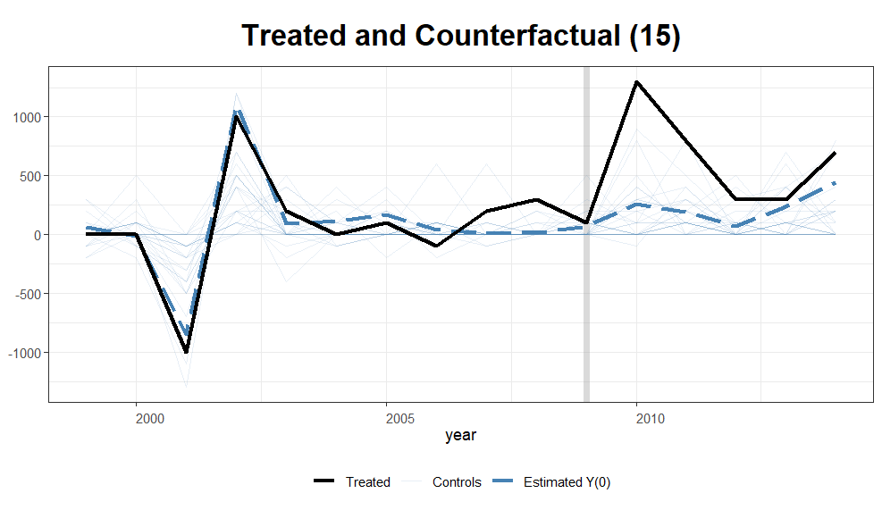

# Revenue or Resilience? Evidence from a Regional Windfall in China

**Andrew Wang** · University of Washington, Department of Political Science · MA Thesis

---

## Overview

Why do states invest in public goods even when doing so reduces short-run net revenue?

The conventional political economy answer, following Levi (1988) and Olson (1993), is that public goods serve revenue: they raise output, lower the coercive cost of extraction, and expand the tax base. On this view, public goods are instruments of a fundamentally revenue-maximizing state.

This thesis challenges that account. I argue that states also value **resilience** — the slack in coercive capacity that remains after extraction, policy implementation, and shock management demands are met. A state with greater resilience can absorb unexpected shocks (ethnic unrest, natural disasters, fiscal crises) without approaching the coercive threshold at which governing becomes politically untenable. Crucially, resilience has value even when its marginal fiscal return is low.

To distinguish a pure revenue-maximizer from a joint revenue-resilience maximizer, I study an unusual natural experiment: China's 2010–2011 export restrictions on Rare Earth Elements (REEs), which generated a large, short-term, geographically concentrated revenue windfall in Inner Mongolia — a politically sensitive frontier region with a large ethnic minority population. A pure revenue-maximizer should redirect windfall revenue toward provinces with higher marginal fiscal return. A state that also values resilience should invest in Inner Mongolia itself, even if the marginal fiscal return there is lower, because Inner Mongolia's political sensitivity raises the marginal value of coercive slack.

**Main finding:** Rail infrastructure investment in Inner Mongolia increased sharply after 2010 relative to a synthetic control counterfactual, while a placebo treatment assigned to 2008 produces a substantially weaker effect. This pattern is inconsistent with pure revenue maximization and supports the hypothesis that China's central government jointly values revenue and resilience.

---

## Formal Model

The state chooses tax rate $\tau$ and public goods provision $G$ to maximize:

$$U(\tau, G) = (1 - \omega) R^g + \omega Z$$

where $R^g$ is gross revenue, $Z = \bar{C} - C^{\text{tot}}$ is resilience (coercive slack), and $\omega \in [0, 1]$ weights the revenue-resilience tradeoff. This nests pure revenue maximization ($\omega = 0$) and pure resilience maximization ($\omega = 1$) as special cases.

The two-region extension of the model generates the key empirical predictions:

- **Under $\omega = 0$:** The center equates marginal fiscal returns across regions; additional spending flows away from Inner Mongolia, which already has high output and well-developed public goods.
- **Under $\omega > 0$:** The center also weighs marginal resilience returns, potentially allocating *more* to Inner Mongolia if its political sensitivity raises the marginal value of coercive slack there — even if marginal fiscal return is lower.

---

## Empirical Design

**Outcome variable:** Annual change in kilometers of railway in operation within each province. Rail construction serves as a proxy for central government investment intent: major rail projects in China during this period were heavily influenced by central planning and financing.

**Identification:** Generalized Synthetic Control (Xu, 2017), which estimates a province-specific counterfactual for Inner Mongolia using a latent interactive fixed-effects model. Treatment is assigned in 2010 (onset of the REE price shock). The specification controls for provincial government expenditure, freight rail traffic, disposable income, land area, and population density.

**Placebo test:** Treatment is re-assigned to 2008, a period with no corresponding revenue shock, to assess whether the post-2010 divergence is specific to the windfall.

**Data sources:**
- China Macro Economy panel (provincial, annual)
- China Railway statistics (by province)
- National Bureau of Statistics of China

---

## Results

The main specification shows a positive deviation of Inner Mongolia's rail investment from its synthetic control counterfactual beginning in 2010, with the largest divergence in the first post-treatment years. The placebo specification (2008 treatment) produces a weaker and less sustained effect, lending support to the interpretation that the divergence is associated with the rare-earth revenue shock.

The estimated treatment effect is positive but statistically imprecise in later post-treatment years, so findings should be read as suggestive rather than definitive.



---

## Repository Structure

```
MA-Thesis/
├── AYW_MA_Manuscript/
│   ├── main.tex                         # Thesis manuscript (LaTeX)
│   ├── Main_Gap.png                     # GSC treatment effect (gap plot)
│   ├── Main_Counterfactual.png          # Treated vs. counterfactual trajectory
│   ├── Placebo_2008_Gap.png             # Placebo gap plot (2008)
│   └── Placebo_2008_Counterfactual.png  # Placebo counterfactual (2008)
├── China_Macro_Economy-Yearly_by_Province_clean_v2.csv   # Provincial macro panel
├── China_RR-Yearly_(by_Province).csv                     # Provincial railway data
└── MA-Thesis.Rproj                      # R project file
```

---

## Technical Stack

| Component | Tools |
|---|---|
| Causal inference | R (`gsynth` — Generalized Synthetic Control) |
| Data wrangling | R (`tidyverse`, `data.table`) |
| Manuscript | LaTeX (APSR submission format) |
| Data | China NBS provincial panel; railway statistics |

---

## References

- Levi, M. (1988). *Of Rule and Revenue.*
- Olson, M. (1993). Dictatorship, Democracy, and Development. *American Political Science Review.*
- Xu, Y. (2017). Generalized Synthetic Control Method. *Political Analysis.*
- Abadie, A., Diamond, A., Hainmueller, J. (2010). Synthetic Control Methods for Comparative Case Studies. *JASA.*
